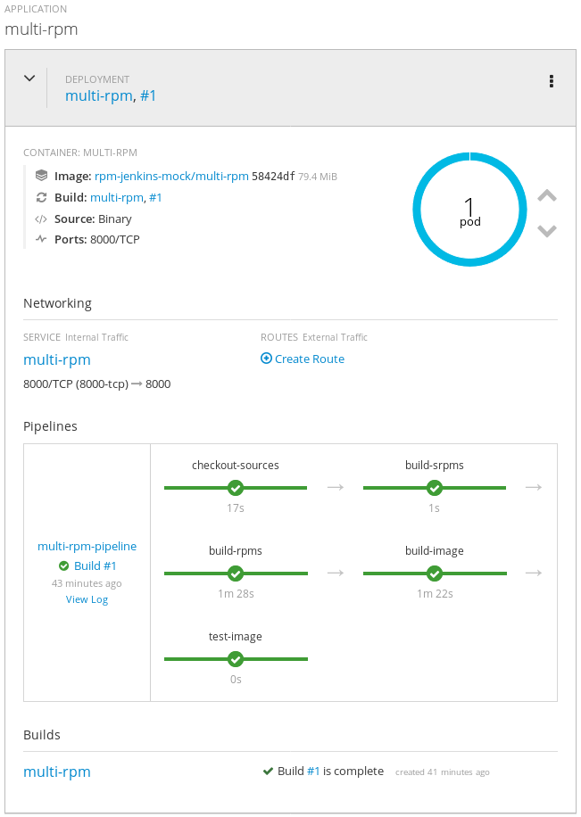

# RPM Container Workflows

**Work In Progress**

Linux container/VM images are root file systems.

Distributions such as https://debian.org and https://redhat.com have built filesystems from 10,000s of packages for 20+ years using software packaged in DEB and RPM format.

This repository is a collection of different CI/CD approaches for building container filesystem images using RPMs.

For a much easier and hassle free way of turning source code into working images, checkout [S2I](https://github.com/openshift/source-to-image) or [Buildpacks](https://devcenter.heroku.com/articles/buildpacks).

## Packaging Software for building applications and services

IMHO, these are the current best general ways of packaging and building services, in descending order:

* Platform-as-a-Service (PaaS): Heroku BuildPacks, OpenShift Source-to-Image, AWS Elastic Beanstalk

* Openshift/Kubernetes running Docker containers built with the following:
* * Monolithic RPM/DEB packaging w/ bundled dependencies (/opt/myorg/myapp)
* * RPM Software Collections w/ seperate packages (/opt/myorg/myapp)
* * make install w/ bundled dependencies (DESTDIR=/opt/myapp)
* * System RPM packages (/usr/)
* * make install (DESTDIR=/usr)

* VM/hosts built with
* * (all of the above)

The advantages of RPM/DEB is that they are universally applicable to Containers, VMs and Hosts. They are also relatively easy to vend to third parties, though not as easy as a container. However for simpler out-of-the-box CI/CD workflows, any PaaS builder would be a better choice.

### Advantages of using standard source packaging formats

The common aspect of all of the above approaches is that if your software's source code is in the languages standard packaging format (e.g. Python setup.py, Java Maven, JavaScript Node.JS npm), it becomes easy to wrap with any of these processes (even multiple at the same time during a transition period). Its almost certain that upcoming approaches like Function-as-a-Service (FaaS) will build this way. Most importantly, its easy for developers to maintain as there are lots of existing tools, practices and documentation around it.

### Using RPMs

Proper software packaging like RPM or DEB should be used when not using PaaS BuildPack's can't be used.

### Operating System RPMs

The typical use case for RPMs is packaging software for installation to the OS root. While depending on the existing RHEL/Centos/Debian OS packages is a good choice for long-term projects (~10 years+), for new and fast moving software with lots of changing dependencies this can lead to recurring Dependency Hell.

### Software Collections

The approach of [Software Collections](https://www.softwarecollections.org/en/) largely solve this problem. This is an RPM formalization around building and installing packages for seperate root directories, similar to how the "./configure --prefix=/opt/my-app-root" or "make install DESTDIR=/opt/myapp" flags operates. This way the packages never conflict with the base OS packages, and can have minimal dependencies on the base OS (e.g. between RHEL/CentOS 6->7).

#### RPMs with bundled dependencies

The majority of existing Software Collections maintain every component/dependency in seperate repositories. For small teams, this can have a high maintenance cost. Upgrading a single 3rd party dependency may require updating 10 seperate SRPM repositories (and their consumers). It also makes building and coordinating changes to source control harder.

For a typical Django or Java service etc, these can be packaged as just one Software Collection RPM with bundled dependencies. This SCL can depend on another SCL to provide the language runtime. In practice this makes it similar to how both PaaS builders and developers do "pip install -r requirements.txt" into an isolated environment root. This way you can get fast iteration, simple builds, the benefits of a proper packaging system and none of the maintenance costs of 3rd party library RPM dependency hell.

The bundled dependencies themselves can be checked into VCS using GIT-LFS or dist-git. (Example: [Facebook checks-in dependencies to monorepo](https://yarnpkg.com/blog/2016/11/24/offline-mirror/). This allows developing and building the packages to be done offline and with predictible package version control.

## Examples

Assembling an image from packages usually looks like this:

    Package source -> SRPMs -> RPMs -> Container Image

For simplicity and composability, each of these components is split into their own seperate git repositories.

General layout:

* 1 repo per RPM
* 1 repo per container (i.e. Dockerfile)
* 1 repo for container build orchestration definitions (Jenkinsfile, Kubernetes objects)

For single RPM projects with bundled dependencies, these can be combined.

### Getting Started

To run these examples, you'll need a working Openshift cluster.

Sample run:

    $ oc cluster up
    $ cd docker_build
    $ ./project.sh create
    $ cd examples/multi_rpm
    $ ./example.sh create
    $ ./example.sh build

### Building RPMs inside Docker build

[docker_build/examples/multi_rpm](docker_build/examples/multi_rpm)

This example builds the RPMs inside the Docker image build phase. A simple Makefile is called from the Docker build which handles the repository fetching and SRPM assembly. These are then built serially with a simple rpmbuild. The installed build dependencies are then removed and the resulting RPMs are installed. 

One advantage of this method is its mechanical simplicity: only Docker and rpmbuild are needed. Another is that the build and runtime environment are the same container.

Using the Makefile and Dockerfile, the repos and container can be all be modified and built locally to test changes.

TODO: Currently the rpmbuild itself happens as root user (even though it should be confined within the Docker build). It should be easy to execute rpmbuild as non-root to lower attack surface.

[docker_build/examples/multi_rpm_submodules](docker_build/examples/multi_rpm_submodules)

This works like the above, except the RPMs repos are fetched with git submodules instead of from the Makefile.

[docker_build/examples/rpmbuild_chain/](docker_build/examples/rpmbuild_chain/)

Similar to above examples, except using rpmbuild-chain.

[docker_build/examples/rpmbuild_chain_repo/](docker_build/examples/rpmbuild_chain_repo/)

Build the RPMs to a YUM repo, then serve that from a container for use by other builds.

### Building RPMs with mock

[jenkins_mock/examples/multi_rpm](jenkins_mock/examples/multi_rpm)

In this example, a Jenkinsfile defines a pipeline where SRPMs are built with [mock](https://github.com/rpm-software-management/mock/wiki) running on a Jenkins slave. A Makefile fetches the SRPMs and builds them using mockchain. The resulting RPMs are archived to Jenkins, then sent to a container build using "oc start-build --from-dir (RPMS+Dockerfile)" binary input build which copies them into the Docker build context. These are then installed during the Docker build.

One caveat of this approach is that currently mock must run in containers with CAP_SYS_ADMIN privilages, in order to set up chroot and mounts.

Using the same Makefile and Dockerfile, its possible to pull and modify the RPM repos locally, and build them with mock into a working container for testing. This can be done independantly of the build infrastructure. Like Docker, building under mock should be reproducible and portable, and not need any other tools to be installed, provided the local host mock has the same access to the YUM repositories as the mock configured on the Jenkins slave.

[jenkins_mock/examples/multi_rpm_imagesource](jenkins_mock/examples/multi_rpm_imagesource) 

This follows the same pipeline workflow, except the built RPMs are pushed to a seperate artifact image stream, which is then used as an input to the container build.

### Software Collections

[software_collections/examples/bundleddeps/](software_collections/examples/bundleddeps/)

This example demonstrates building a Django app with bundled dependencies. The final product is a monolithic application RPM (along with a few SCL related packages) that installs to its own independent /opt/ folder. The Python runtime is provided by another SCL that we can depend on. Changes to the application and dependencies can all be built and tested locally with "docker build".

## TODO

* New package for python-demo_app uwsgi dependencies and init script, it will simplify the Docker files a bit

### More Examples

* mock SCM
* tito
* push artifacts to pulp
* koji
* (dist-git?.. not so useful for CI/CD)
* fedora modularity modules?

### Needed tools

#### mockchain without mock (rpmbuildchain?)

Replace the [rpmbuild section here](docker_build/examples/multi_rpm/repos/demo_container/Makefile) with tool or script.
